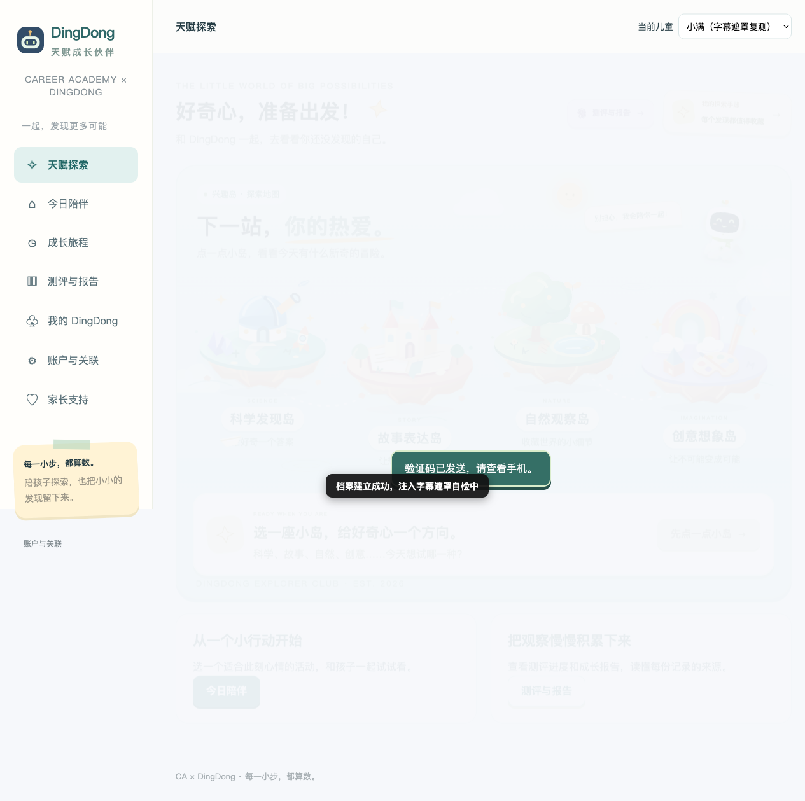
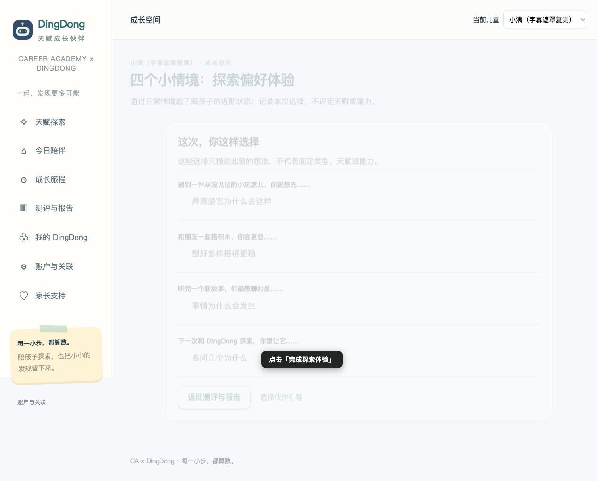
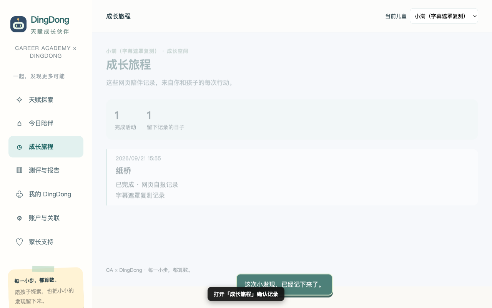
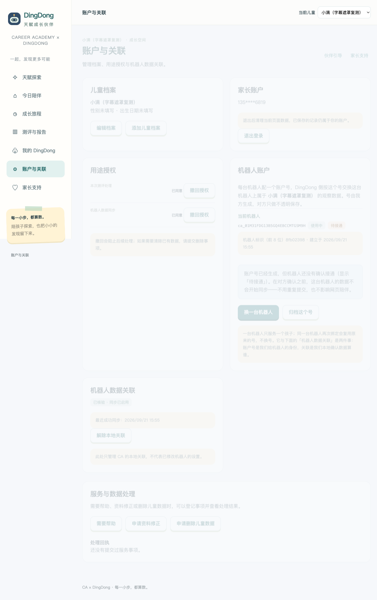
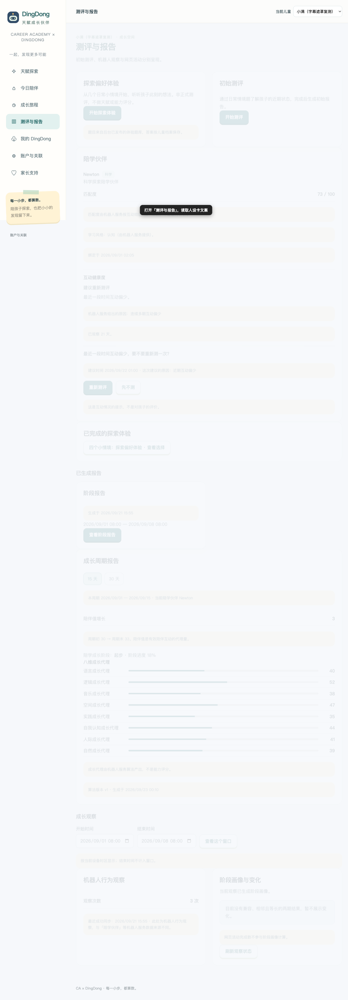
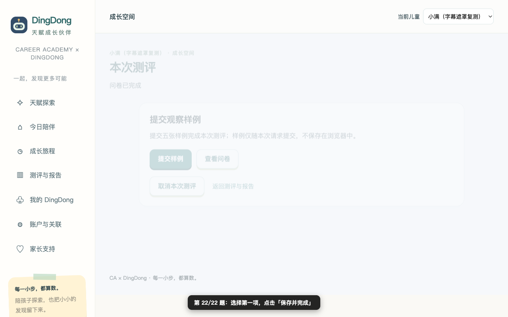
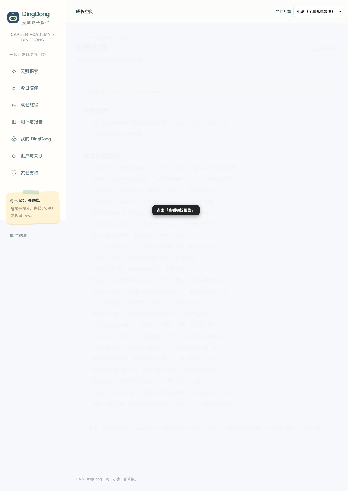
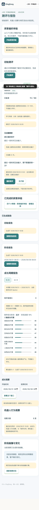

# 叮咚家长端 · 保姆级操作指南（从 0 到 1）

## 测试入口信息

| 项目 | 内容 |
|---|---|
| **家长端网址** | http://110.42.225.196/dingdong/ |
| **登录方式** | 任意手机号（11 位数字）+ 固定验证码 `00000` |
| **运营后台**（另见后端指南） | http://110.42.225.196/ops/ |
| **当前版本** | 0.3.7（演示环境，测试数据） |

> 说明：这是演示环境，短信验证码固定为 `00000`，不需要真实手机收码。每个手机号对应一个独立家庭，换一个号就是全新数据。

---

## 你将在 20 分钟内完成的完整旅程

登录 → 建立儿童档案 → 探索体验四题 → 完成一次亲子活动 → 绑定机器人 → 查看人设卡 → 完成 22 题正式测评 → 查看初始报告

每一步都有截图对照，跟着做即可。

---

## 第 1 步：登录

1. 打开浏览器（推荐 Chrome / Safari），访问 **http://110.42.225.196/dingdong/**
2. 在「手机号」输入框填任意 11 位手机号（如 `13800001111`）
3. 点击 **获取验证码**
4. 在「验证码」输入框填 `00000`
5. 点击 **登录**

**看到什么算成功**：页面跳到「建立儿童档案」表单页（见下方截图）。

---

## 第 2 步：建立儿童档案

1. 在「姓名或称呼」填孩子的小名（如 `小满`）
2. 其余选项按实际情况填写（性别、生日等）
3. 点击 **保存档案**

**看到什么算成功**：出现「好奇心，准备出发！」欢迎页。

---

## 第 3 步：探索体验（四道轻松小题）

这是**非正式**的体验环节，没有对错，只是记录孩子的选择倾向。

1. 点击底部导航 **测评与报告**
2. 点击 **开始探索体验**
3. 勾选「我已阅读并同意本次测评用途」，点击 **同意并开始**
4. 依次回答 4 道情境题（每题选一个最贴近的选项，点击 **保存并下一题**；最后一题点 **保存并完成**）
5. 点击 **完成探索体验**

**看到什么算成功**：出现「这次，你这样选择」结果页。

---

## 第 4 步：完成一次今日陪伴活动

1. 点击底部导航 **今日陪伴**
2. 任选一个活动卡片，点击 **查看活动**
3. 在弹窗里点击 **开始活动**
4. 按 3 个步骤提示陪孩子完成活动，每步点击 **下一步**
5. 最后选择「活动感受」（如：有趣），在「一句话记录」里随便写一句（如 `玩得很开心`）
6. 点击 **完成活动**
7. 点击底部导航 **成长旅程**

**看到什么算成功**：旅程页时间线上出现刚才的一句话记录。

---

## 第 5 步：绑定机器人并授权同步

这一步连接「陪学伙伴」机器人数据（演示环境自动模拟）。

1. 点击底部导航 **账户与关联**
2. 在「绑定机器人」区域：
   - 有 NFC 标签的：用手机碰一下标签，会自动弹出绑定窗口
   - 没有 NFC 的：直接在页面上点击绑定入口，凭据框填任意标识（如 `TEST-001`），点击 **确认绑定**
3. 点击 **核验并关联**
4. 勾选「我已阅读并同意机器人数据同步用途」
5. 在「核验凭据」框填任意内容（如 `TEST-PROOF-1`），点击 **确认核验**

**看到什么算成功**：关联记录显示「已核验 · 同步已启用」。

---

## 第 6 步：查看孩子的人设卡

1. 点击底部导航 **测评与报告**
2. 滚动到「陪学伙伴」人设卡区域

**看到什么算成功**：人设卡显示陪学伙伴名字（如 Newton）、匹配度、学习风格、绑定日期。鼠标悬停在学习风格等标签上可以看到原始取值。

---

## 第 7 步：正式测评（22 题）

这是正式的测评环节，请尽量连续完成。

1. 在「测评与报告」页点击 **开始测评**
2. （若弹同意框）勾选并同意
3. 依次回答 22 道题，每题点击 **保存并下一题**（最后一题是 **保存并完成**）
4. 完成后按页面提示提交观察样例

**看到什么算成功**：页面提示进入观察样例环节，初始报告开始生成（一般几秒到一两分钟，真实异步任务生成）。

---

## 第 8 步：查看初始报告

1. 回到「测评与报告」页
2. 稍等片刻（可下拉刷新），「已生成报告」区域会出现 **初始报告**
3. 点击 **查看初始报告**

**看到什么算成功**：报告页展示八维成长代理、成长观察窗口、阶段画像等内容。

---

## 页面导航总览

家长端共 7 个主页面（底部导航 + 首页）：

| 页面 | 入口 | 内容 |
|---|---|---|
| 成长空间（首页） | 底部导航「成长空间」 | 总览入口卡片 |
| 测评与报告 | 底部导航 | 探索/测评/报告/人设卡 |
| 今日陪伴 | 底部导航 | 每日活动 |
| 成长旅程 | 底部导航 | 时间线记录 |
| 成长观察 | 底部导航 | 观察窗口 |
| 账户与关联 | 底部导航 | 机器人绑定/授权 |
| 设置 | 底部导航 | 账户设置 |

移动端（390×844 视口）同样可用，导航自动折叠为底部条：

---

## 常见问题

| 问题 | 处理 |
|---|---|
| 收不到验证码 | 演示环境验证码固定 `00000`，直接填即可 |
| 报告一直「正在生成」 | 刷新页面等待 1-2 分钟；仍不行记录下来反馈 |
| 页面白屏/打不开 | 确认网址是 `http://`（不是 https）；换 Chrome 试试 |
| 想重新从零开始 | 换一个新手机号登录即是全新家庭 |
| 机器人绑定失败 | 确认在「账户与关联」页操作；凭据随意填也能绑定（演示模式） |

---

*环境版本 0.3.7 · 指南基于 2026-09-22 自动化全流程测试（31 项检查 + AI 内容判定）*
