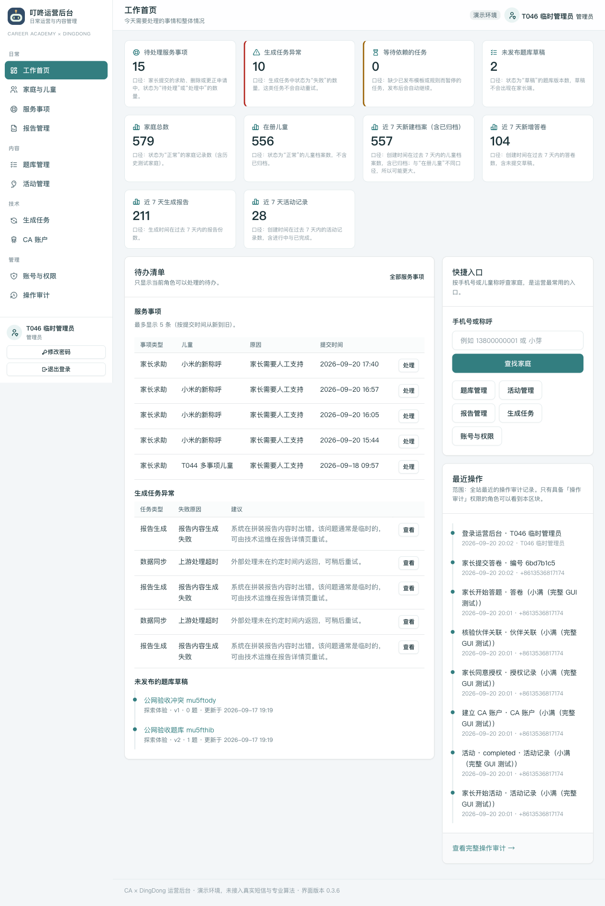
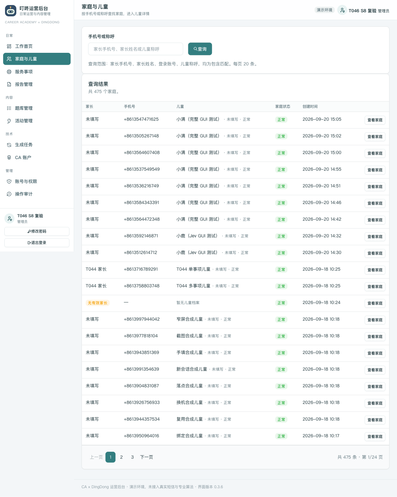
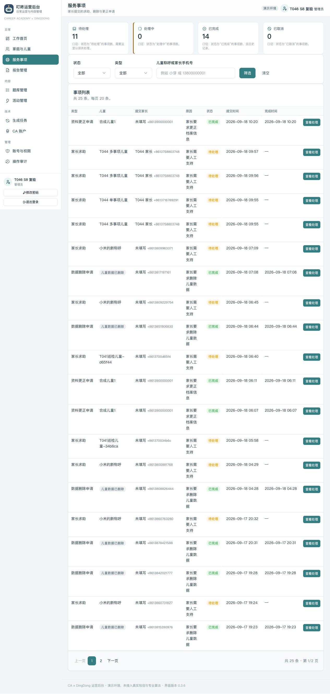
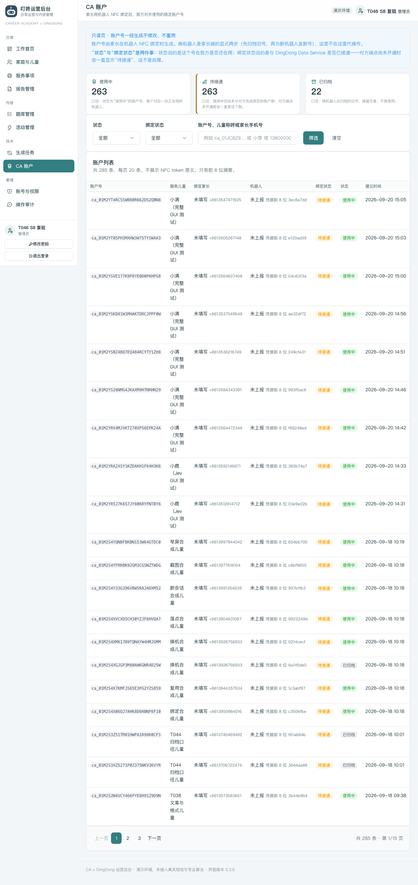
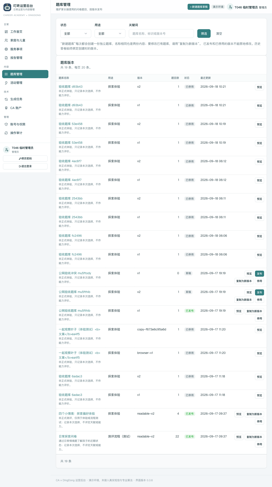

# 叮咚运营后台 · 保姆级操作指南（从 0 到 1）

## 测试入口信息

| 项目 | 内容 |
|---|---|
| **运营后台网址** | http://110.42.225.196/ops/ |
| **测试账号** | `tester` |
| **测试密码** | 单独提供（不入本仓库；本地记录见 `/tmp/dd-tester-cred.txt`，遗失可在后台重置） |
| **权限** | 管理员（account_admin，全部功能可用） |
| **家长端**（另见家长端指南） | http://110.42.225.196/dingdong/ |
| **当前版本** | 0.3.7（演示环境） |

> 说明：演示环境数据库为 fixture 演示数据；运营操作（发布、处理）会影响数据，但随时可通过「复制为新版本」等方式重新构造，放心操作。

---

## 你将看到的核心模块

登录 → 工作首页（待办/卡片）→ 家庭与儿童 → 服务事项 → CA 账户 → 题库管理 → 登出

---

## 第 1 步：登录

1. 打开浏览器（推荐 Chrome），访问 **http://110.42.225.196/ops/**
2. 会自动跳到登录页 `http://110.42.225.196/ops/login/`
3. 用户名填 `tester`，密码填测试密码（单独提供，见顶部说明）
4. 点击 **登录**

**看到什么算成功**：进入工作首页（仪表盘）。

> 提示：未登录直接访问 `/ops/` 会 302 跳到登录页，这是正常防护。

---

## 第 2 步：工作首页（仪表盘）

登录后就是工作首页，包含：

- **待办清单**：服务事项（最多显示 5 条，按提交时间从新到旧）、生成任务异常等
- **统计卡片**：近期新增家庭/儿童、报告生成情况等

**看什么**：这里能快速掌握「现在有什么需要处理的」。点击待办条目可直接进入对应详情。

---

## 第 3 步：家庭与儿童

左侧导航 **家庭与儿童**（`/ops/families/`）：

1. 列表页：所有测试家庭，可按手机号/家长姓名搜索
2. 点击任一家庭进入**家庭详情**：
   - 家长信息（「主要家长」角色、手机号）
   - 该家庭下的儿童列表
3. 点击儿童进入**儿童详情**：
   - 档案信息、只读「机器人账户」行
   - 观察记录、已生成报告

**测试要点**：家长端（家长指南第 2 步）建的新档案会出现在这里。

---

## 第 4 步：服务事项

左侧导航 **服务事项**（`/ops/services/`）：

1. 列表页：家长通过家长端提交的服务申请，可按状态筛选（待处理/已处理）
2. 点击进入**详情页**：
   - 查看申请内容、提交时间、关联家庭
   - **处理**：填写处理结果并提交，事项状态流转为已处理
3. 该儿童仅有一条事项时，详情页不显示「其他服务事项」区块（避免重复）

---

## 第 5 步：CA 账户

左侧导航 **CA 账户**（`/ops/ca-accounts/`）：

- 家长端绑定机器人后产生的对接账户列表
- 列含：账户号、状态（active/retired）、家长（姓名空显示「未填写」）、「凭据前 8 位」
- 点击进入详情可查看同步检查点、事件流水

**测试要点**：家长端（家长指南第 5 步）完成绑定核验后，这里会出现对应账户。

---

## 第 6 步：题库管理

左侧导航 **题库**（`/ops/questionnaires/`）：

1. 列表页：问卷（探索体验 4 题 / 正式测评 22 题等）的版本列表，含草稿/已发布状态
2. 点击 **新建** 创建草稿（技术标识与版本号自动生成，免填）
3. 草稿编辑后点击 **发布**，家长端「测评与报告」即用新题目
4. **复制为新版本**：从已发布版本复制出可编辑的新草稿

**测试要点**：发布一版新问卷后，到家长端「开始测评」能看到新题目。旧版本数据不受影响。

---

## 第 7 步：登出

右上角用户菜单 → **退出登录**，回到登录页。

> 安全说明：登出后再次访问 `/ops/` 会被拦到登录页；Cookie 为 HttpOnly 会话。

---

## 常见问题

| 问题 | 处理 |
|---|---|
| 登录报「角色不允许此操作」 | 用 tester 账号（管理员） |
| 页面 404 | 确认网址带末尾斜杠（如 `/ops/families/`） |
| 看不到家长端新建的数据 | 检查筛选条件（状态/日期），或清空筛选 |
| 想重置测试数据 | 不需要重置：家长端换新手机号即是全新家庭数据流 |

---

*环境版本 0.3.7 · 指南基于 2026-09-22 自动化全流程测试（31 项检查 + AI 内容判定）*
