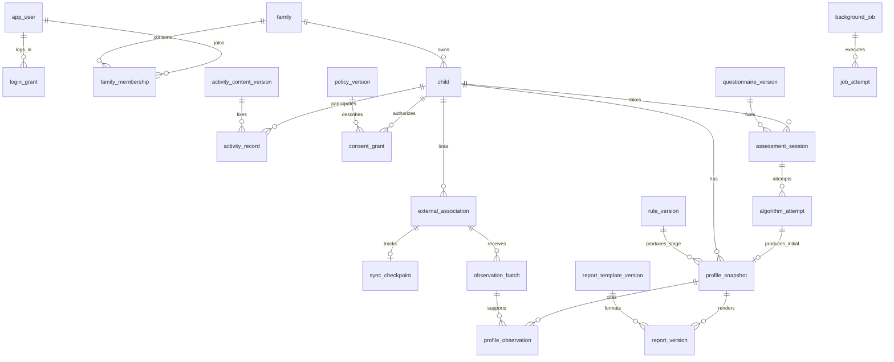

# 数据库表结构 V0.1

> 文档状态：历史设计基线，保留当时的建议与判断，不能把下文“当前/尚未实现”当作现状。2026-09-12 已有 M1–M5 实现；当前入口见 [文档索引与当前状态](../文档/文档索引.md)，实际字段见 [模型字段清单](数据库实际字段_M5.md)。外部供应商尚未接入。

状态：逻辑表结构与 PostgreSQL 字段设计，供后续 Django Models 和迁移实现使用；尚未建库、生成迁移或进行数据库运行验证。基于后台设计 V0.2、短信＋JWT、不留存指纹、CA 主动获取 DingDong 数据的已知边界。下文标注“建议”的业务选择尚未视为用户逐项确认。

## 一期简化原则（本轮更新）

按小项目规模建设：普通资料用常规字段，不另做字段加密与密钥轮换；权限和登录复用框架；跨表规则集中在业务服务；任务复用 Celery 与现有任务表。去掉独立 outbox、认证版本字段、验证码密钥版本、TOTP 前置要求、防篡改审计和审批流程。保留家庭隔离、授权校验、凭据保护、业务去重、结果版本以及指纹不留存。

## 1 设计约定

- 一个 PostgreSQL 数据库，按 Django app 划分模块，不拆微服务或独立数据库。表名为建议的 `db_table`，以迁移文件最终落定。
- 自有表默认 `id uuid PK`（应用生成 UUIDv4）、`created_at timestamptz NOT NULL`；可变实体加 `updated_at timestamptz NOT NULL`。不可变结果和事件不需要假装可编辑的 updated_at。UUID 不代替归属鉴权。
- 下表 `?` 表示 NULL 允许，其余字段非空；FK 默认指向对应表 id。时间统一存带时区时间；窗口使用左闭右开 `[start,end)`。枚举用 varchar＋CHECK，便于 Django 迁移。所有状态枚举均须真正创建 CHECK，而非只靠表单 choices。
- 金额无需求，不建余额/支付表。分数不假设百分制；维度及范围由已发布结果结构定义校验。JSONB 仅存版本化、白名单结构，不存任意上游响应。
- 业务外键原则上 PROTECT/数据库 NO ACTION；受控删除流程按依赖顺序处理，不能按删除一个家长自动级联清空全家。明确的纯附属表可在迁移中选择 CASCADE，见删除章节。
- 家庭隔离以 Child→Family→有效 FamilyMembership 为根。能从单一外键推导的 family_id 不重复保存；不得直接相信请求中的家庭或儿童 ID。
- 每张表都不设通用 metadata、附件或原始报文兜底字段。没有图片、图片 URL、指纹摘要/哈希、base64、指纹模板或特征向量字段；不建立“指纹档案”。

## 2 关系总览

图中省略操作者、授权和任务目标的部分外键，完整定义如下。家长只有一套登录账号表；儿童不建登录账号。家庭、问卷、算法尝试、画像和报告是不同对象，不能用一张大表的 status 混在一起。

## 3 身份与家庭

### 3.1 app_user：扩展脚手架用户模型

保留 AbstractUser 的密码哈希、username、is_active、is_staff、is_superuser、last_login、date_joined 等标准字段及用户组关联。username 为内部唯一标识：家长用服务端生成值，工作人员使用登录名；不拿手机号直接当 username。默认 email 非登录必填项，不开启家长邮件注册。

| 字段 | 类型 | 含义/约束 |
| --- | --- | --- |
| account_kind | varchar(16) | parent / staff；同一自然人如有两种用途，采用分开的账号 |
| phone | varchar(16)? | 规范化手机号明文，统一采用 E.164 格式（含国家码，如 +8613800000000）；不使用空字符串 |
| display_name | varchar(80) | 后台显示名或家长昵称，默认空字符串 |

约束：parent 必须有手机号且 is_staff=false、is_superuser=false；staff 不通过短信家长入口登录；is_superuser=true 必须 is_staff=true。parent 的 phone 建条件唯一索引（account_kind='parent'），停用后也不自动释放号码。手机号更换需专门验证和归属流程，一期不做简单后台改字段。parent 使用 Django 不可用密码，不保存占位明文密码。

按用户确认，一期手机号采用普通明文字段，不做应用层加密、HMAC 检索索引或手机号密钥管理。写入与查询使用相同的号码规范化规则；后台列表默认脱敏，接口按权限返回必要字段，不直接序列化完整用户模型。

### 3.2 sms_challenge：一次性验证码挑战

| 字段 | 类型 | 含义/约束 |
| --- | --- | --- |
| phone | varchar(16) | 规范化手机号明文，与用户表使用相同格式 |
| purpose | varchar(24) | 一期 login |
| code_digest | varchar(64)? | HMAC(challenge_id＋规范化手机号＋用途＋验证码)，消费/过期清除 |
| status | varchar(16) | pending / sent / failed / consumed / expired / locked |
| expires_at | timestamptz | 必须晚于创建时间 |
| failed_attempts | smallint | 默认 0，范围 0..5 |
| sent_at / consumed_at | timestamptz? | 实际发送/消费时间 |
| provider_request_id | varchar(128)? | 必要短信请求号；不存完整供应商响应 |
| error_code | varchar(64)? | 经过映射的错误码 |

索引 `(phone,purpose,created_at DESC)`、`expires_at`。限频在 Redis 做手机号/IP 的原子窗口计数，过期自动清除，不额外建设长期 IP 日志表。并发重新发送时按手机号串行化，旧挑战失效；不能用“当前时间未到期”的动态条件做唯一索引。验证码验证加行锁，消费与创建 LoginGrant 同一事务提交，防止并发二次登录授权。发送失败不产生有效挑战；只记录安全错误码。

### 3.3 login_grant：家长登录授权

| 字段 | 类型 | 含义/约束 |
| --- | --- | --- |
| user_id | FK app_user | 仅 parent，应用服务校验 |
| current_refresh_jti | uuid UNIQUE | 当前有效刷新令牌 ID，不存 JWT 正文 |
| expires_at | timestamptz | 建议首次登录后固定 7 天，不随刷新延长 |
| revoked_at | timestamptz? | 非空即撤销 |
| revoke_reason | varchar(32)? | logout / logout_all / disabled / security |
| last_refreshed_at | timestamptz? | 最近刷新时间 |

索引 `(user_id,created_at DESC)`、`expires_at`。刷新时锁定此行，验证有效性及 current_refresh_jti 后轮换。access JWT 引用 grant ID，每次请求检查用户状态、到期与撤销。只删 Cookie 不算退出。退出全部设备直接批量撤销该用户的有效 LoginGrant；账号停用时同步撤销授权。工作人员复用 Django 会话失效机制，不自建认证版本体系。

采用这张表作为撤销事实来源，Simple JWT 用于令牌签发/验签，不再同时启用一套默认 OutstandingToken/Blacklist 存储；如最终依赖配置需要启用，必须先核查其持久字段，避免把完整 token 再存一遍。工作人员会话复用 Django session，不塞入家长 LoginGrant。

### 3.4 family、family_membership、child

| 表 | 业务字段（除公共字段） | 约束与索引 |
| --- | --- | --- |
| family | status varchar(16): active/frozen/closed | 不建组织名称、地址等无用字段 |
| family_membership | family_id FK family；user_id FK app_user；role varchar(16)=owner；ended_at timestamptz? | 条件唯一 family_id WHERE ended_at IS NULL；条件唯一 user_id WHERE ended_at IS NULL；ended_at≥created_at |
| child | family_id FK family；name varchar(80)；gender varchar(16) DEFAULT unknown（male/female/unknown）；birth_date date?；status varchar(16): active/archived | `(family_id,status,created_at)`；name 为姓名或日常称呼，不要求实名；不建年级字段 |

一期建议一位家长只管理一个家庭、一个家庭一个有效 owner，可有多个儿童数据记录；界面是否开放多孩子另定。至少一个 owner 的创建条件由事务服务保证（唯一索引只能保证至多一个）；建立账号、家庭和 membership 同事务。只允许 parent 加入家庭，儿童不跨家庭转移。

儿童基本信息补充为姓名或日常称呼、性别（可不填）和出生日期。用户明确不关心当前年级，不采集、不建 grade 字段，也不由年龄推算年级。出生日期目前按可空 date 字段设计，实际采集精度和测评前是否必填待算法输入确认；若最终只采集月份，实施前改为明确的月份字段，不能用虚构的某日表示精确生日。不存实时 age 字段，根据出生信息和参考时间计算，测评时固定实际采用的年龄口径。archived 只是业务不可用状态，不代表完成删除。

## 4 授权与外部关联

### 4.1 policy_version：授权说明版本

`purpose varchar(32)`（assessment_processing / dingdong_sync）；`version varchar(32)`；`body text`（说明正文）；`body_digest varchar(64)`；`status varchar(16)`（draft/published/retired）；`published_at timestamptz?`；`published_by FK app_user?`。唯一 `(purpose,version)`；每 purpose 至多一条 published，条件唯一索引。发布后的正文不可改，停用不删除历史文本。digest 只针对说明文字。

### 4.2 consent_grant：按用途授权

| 字段 | 类型 | 含义 |
| --- | --- | --- |
| child_id | FK child | 被处理数据所属儿童 |
| granted_by | FK app_user | 当时有效家长 |
| policy_version_id | FK policy_version | 固定说明版本 |
| purpose | varchar(32) | 与说明 purpose 一致，方便约束 |
| revoked_at | timestamptz? | 撤回后重新同意必须新增记录 |
| revoke_reason | varchar(32)? | 允许的原因码 |

条件唯一 `(child_id,purpose) WHERE revoked_at IS NULL`；created_at 为同意时间。policy purpose 一致性在统一业务服务中校验，不自建数据库触发器。父母身份和当时家庭归属由事务服务校验。

授权撤回不自动等于删除历史报告；停止后续处理、是否仍可展示既有结果、删除请求分别处理。当前版本更换是否必须重新同意由业务策略判断，不以“存在任意未撤回记录”替代用途/版本检查。处理开始和结果提交都验证授权。

### 4.3 external_association：儿童与上游身份对应

`child_id FK child`；`provider varchar(32)='dingdong'`；`external_subject_id varchar(255)`；`subject_kind varchar(32)`；`status varchar(16)`（pending/verified/revoked/rejected）；`verification_method varchar(64)?`；`verification_reference varchar(128)?`；`verified_at timestamptz?`；`ended_at timestamptz?`。

索引 `(child_id,provider,status)`。verified 时 verified_at 非空、ended_at 为空；revoked/rejected 时 ended_at 非空。provider＋subject_kind＋external_subject_id 在 status='verified' 时条件唯一；一期建议 child＋provider 同样只允许一个 verified 关联。

这里 external_subject_id 是“可唯一识别上游儿童数据主体的标识”，不能未经确认当成设备序列号。若 DingDong 仅给共享设备 ID，必须先明确如何区分儿童，否则不启用正式关联。设备 ID 与儿童标识是否拆表属于契约待定项；现阶段不建设备库存/控制表。任何核验凭据不得包含指纹、完整报文或机器人访问密钥。解绑不把历史观察改挂到新孩子。

## 5 内容版本、测评与算法调用

### 5.1 questionnaire_version：题库版本

`code varchar(64)`；`version varchar(32)`；`status varchar(16)`（draft/published/retired）；`schema_version varchar(32)`；`questions jsonb`；`content_digest varchar(64)`；`published_at timestamptz?`；`published_by FK app_user?`。

唯一 `(code,version)`；code 的 published 条件唯一。questions 是自有结构的有序题目数组：每题稳定 question_code、题型、文案、必填条件和选项 code。保存和发布时验证 code 不重复、选项与逻辑合法、大小和题量上限；不把演示四题固化成正式题库。一期不独立建设题目/选项/跳题规则十几张表；未来需要跨问卷题目复用和分析再拆分。

### 5.2 rule_version：阶段画像更新规则版本

`code/version/status/schema_version/content_digest/published_at/published_by` 与题库约定相同；`provider varchar(64)`；`implementation_ref varchar(255)`（已审核算法/部署版本标识，不是可执行任意代码）；`config jsonb`（白名单参数）；`output_schema jsonb`（允许的维度、单位、取值范围）。唯一 `(code,version)`，code 的 published 条件唯一。

尚无规则时可以不建数据行，绝不能放默认权重假装完成成长评分。config 不存源码、密钥、URL 凭据和可执行表达式。发布时在同一事务内校验内容和状态，不额外维护独立的校验摘要及审批阶段。

### 5.3 report_template_version：报告模板版本

同样的版本/发布公共字段；`code varchar(64)`；`schema_version varchar(32)`；`template jsonb`（受限结构的章节、文案和占位符）。唯一 `(code,version)`、每 code 一个 published。模板内容不可直接运行 Python/任意模板表达式，预览使用合成数据。三种内容版本均发布后不可原地改内容，停用后旧引用仍可读。

### 5.4 assessment_session：一次测评及可恢复问卷

| 字段 | 类型 | 含义/约束 |
| --- | --- | --- |
| child_id | FK child | 测评对象 |
| started_by | FK app_user | 创建家长 |
| consent_grant_id | FK consent_grant | 本次测评用途授权 |
| questionnaire_version_id | FK questionnaire_version | 创建时固定已发布版本 |
| create_request_key | uuid | 客户端创建幂等键，唯一 `(started_by,create_request_key)` |
| status | varchar(24) | draft / ready / processing / needs_recapture / result_unknown / completed / cancelled / expired |
| answers | jsonb | question_code→允许的选项 code 或受限答案值，默认 {} |
| revision | bigint | 默认 1，保存问卷采用乐观锁，防止多页覆盖 |
| input_context | jsonb | 已核准的非生物输入，例如参考日期与 age_months；不容纳图片或指纹类别 |
| submitted_at / completed_at / expires_at | timestamptz? | 提交、完成、过期时间 |

索引 `(child_id,created_at DESC)`、`(status,updated_at)`。consent 必须属于相同 child 且 purpose=assessment_processing。answers 以该版本题目校验，提交后不可改；需要改答案则创建新会话。图片丢失只变为 needs_recapture，answers 可保留。

一期合并 Answer 到会话 JSONB，是因为题量有限、尚无逐题统计要求；不重复再建 answers 明细表。算法实际所用答案固定在会话内，提交前加锁检查 revision 和必填完整性。业务摘要与原始答案采用独立序列化输出，运营默认看不到 answers。

### 5.5 algorithm_attempt：一次实际算法调用

`session_id FK assessment_session`；`attempt_no integer`；`request_id uuid UNIQUE`（对外业务请求号）；`provider varchar(64)`；`algorithm_version varchar(128)?`（未回传/未配置时为空，不伪造）；`status varchar(24)`（prepared/running/succeeded/failed/unknown/cancelled）；`started_at/finished_at timestamptz?`；`error_code varchar(64)?`。

唯一 `(session_id,attempt_no)`；一个 session 至多一条 prepared/running/unknown 调用（条件唯一）。unknown 必须先查明状态或显式关闭且要求重新采集，不能自动重传图片。延迟返回只能由当前有效 attempt 提交结果；已取消/失效调用不能覆盖新尝试。初始画像来源的 attempt_id 唯一。

不存 request_body、response_body、图片哈希、图片大小明细或持久文件地址。业务请求号可用于向供应商查询结果，前提是对方实际支持。

## 6 主动同步与观察数据

### 6.1 sync_checkpoint：每个关联的同步进度

`association_id FK external_association UNIQUE`；`status varchar(16)`（enabled/paused/blocked）；`cursor text?`；`last_success_window_end timestamptz?`；`last_success_at timestamptz?`；`next_due_at timestamptz?`；`error_code varchar(64)?`；`revision bigint DEFAULT 1`。

索引 `(status,next_due_at)`。cursor 仅允许供应商确认的无凭据、不含敏感正文的游标；如果包含凭据则不能直接保存。窗口与游标由适配器确定使用方式，不自行生成正式值。并发提交使用行锁/版本检查，禁止旧请求把进度倒退。生产 next_due_at 在频率契约确认前为空。

### 6.2 observation_batch：一次可引用的标准化观察修订

| 字段 | 类型 | 含义 |
| --- | --- | --- |
| association_id | FK external_association | 归属及上游身份 |
| consent_grant_id | FK consent_grant | 获取时对应 dingdong_sync 授权 |
| logical_key | varchar(255) | 适配器生成的同一语义窗口/批次键，生成规则必须明确 |
| revision_no | integer | 同一 logical_key 的内部递增修订号 |
| upstream_version | varchar(128)? | 对方实际提供时保存 |
| window_start / window_end | timestamptz | 观察时间窗口，start<end |
| schema_version | varchar(32) | CA 白名单观察结构版本 |
| granularity | varchar(24) | snapshot / interval_summary；实际形式待对方确认 |
| payload | jsonb | 标准化且获准保存的行为指标；禁止任意原报文 |
| content_digest | varchar(64) | 仅对允许留存的规范化业务数据计算摘要 |
| supersedes_id | FK observation_batch? | 被修订的上一版本 |
| received_at | timestamptz | 完整接收时间 |

唯一 `(association_id,logical_key,revision_no)`；唯一 `(association_id,logical_key,content_digest)`；查询索引 `(association_id,window_end DESC)`。同一上游版本返回不同内容属于冲突，保留安全错误状态并人工确认，不自动接受为新修订。supersedes 必须指向同关联、同 logical_key 的前一修订，采用锁定 checkpoint 后校验并写入。

保存观察与推进 checkpoint 在同一事务；分页尚未完整时不提交最终窗口进度。若契约允许分段提交，则分段必须有独立完整游标和批次定义。滚动快照不能逐次相加；阶段画像选择来源时明确去重/覆盖规则。

一期不建原始事件仓库。若 DingDong 最终只提供事件明细，再增加规范化事件表和事件 ID 去重约束，不能靠 payload 无限扩容。payload 的最终 JSON Schema 依赖上游契约，当前没有真实字段字典。

## 7 初始画像、阶段画像和报告

### 7.1 profile_snapshot：不可变画像版本

| 字段 | 类型 | 含义 |
| --- | --- | --- |
| child_id | FK child | 结果所属儿童 |
| kind | varchar(16) | initial / stage |
| algorithm_attempt_id | FK algorithm_attempt? UNIQUE | initial 必填，stage 为空 |
| rule_version_id | FK rule_version? | stage 必填，initial 为空 |
| baseline_profile_id | FK profile_snapshot? | 阶段规则需要初始画像或前一结果时引用 |
| window_start / window_end | timestamptz? | stage 必填且 start<end；initial 为空 |
| schema_version | varchar(32) | 固定输出结构 |
| result | jsonb | 仅允许保存的非生物业务结果：维度、值、必要说明 |
| derivation_key | varchar(64) UNIQUE | 由规范化来源 ID＋版本＋窗口＋基线生成的确定性键 |
| supersedes_id | FK profile_snapshot? | 同类型同窗口的上一修订，可空 |
| produced_at | timestamptz | 结果形成时间 |

CHECK 强制 kind 与来源字段组合正确；索引 `(child_id,kind,produced_at DESC)`。不设置可人工编辑的“当前总分”；初始结果不被成长画像覆盖。来源、基线、修订必须同一个 child；revision 链只指向已有记录、不得形成循环。上述跨表一致性由统一事务服务校验，并用有意义的越权与一致性测试验证；普通 FK 本身不能完成此校验。

无评分规则时不插入 stage 假结果，保留观察及等待规则的业务任务。result 的 JSON Schema 需排除纹型、细节点、图像和可重建生物特征；“算法输出”不自动代表可以留存。

### 7.2 profile_observation：画像使用的观察来源

`profile_id FK profile_snapshot`；`observation_id FK observation_batch`；唯一 `(profile_id,observation_id)`，索引 observation_id。仅 stage 允许来源记录；观察所属关联的 child 必须与 profile 一致。阶段画像与全部来源边在同事务写入，来源集合不能为空；初始画像不得挂观察边。统一服务先校验来源，再同事务创建画像与来源记录，避免半成品；不增加延迟约束触发器。

### 7.3 report_version：家长报告版本

`profile_id FK profile_snapshot`；`template_version_id FK report_template_version`；`generation_key varchar(64) UNIQUE`；`content_schema_version varchar(32)`；`content jsonb`（已渲染的允许业务文本/结构）；`supersedes_id FK report_version?`；`revision_reason varchar(64)?`；`generated_at timestamptz`。

唯一 `(profile_id,template_version_id)`：同画像＋同模板重复生成不新增；若要修正文案先创建模板版本，输入变化则创建画像版本。generation_key 由上述固定输入生成，不含任何图像。supersedes 只允许同儿童、同报告类型/窗口的前一报告，统一业务服务验证。

失败和等待状态存 BackgroundJob，不在这里存半生成内容；成功记录不可编辑。家长读取通过 profile→child→family 过滤。需要 PDF 时按需生成并明确缓存策略，一期不额外建设报告文件库。当前设计为自动生成后可见，不增加未确认的人工审核工作流。

## 8 任务、可靠派发与审计

### 8.1 background_job：业务任务状态

| 字段 | 类型 | 含义 |
| --- | --- | --- |
| kind | varchar(32) | sync / stage_profile / report / data_request |
| association_id | FK external_association? | sync 目标 |
| child_id | FK child? | stage_profile 目标 |
| profile_id | FK profile_snapshot? | report 目标 |
| data_request_id | FK data_request? | data_request 目标 |
| rule_version_id / template_version_id | 各自 FK? | 固定处理版本；等待规则时 rule 可空，开始执行前必须绑定 |
| window_start / window_end | timestamptz? | 同步/阶段任务窗口，协议需要时必填 |
| requested_by | FK app_user? | 人工请求者；NULL 表示系统调度 |
| business_key | varchar(255) UNIQUE | 同一意图的幂等键，无任意 payload |
| status | varchar(24) | pending / running / waiting / unknown / succeeded / failed / cancelled |
| attempt_count / max_attempts | integer | 默认 0 / 5，非负且 max>0 |
| next_attempt_at | timestamptz? | 计划执行时间 |
| execution_token | uuid? | 当前执行代号，拒绝迟到 worker 覆盖 |
| lease_expires_at | timestamptz? | 运行租约到期时间 |
| finished_at | timestamptz? | 终结时间 |
| error_code | varchar(64)? | 必要错误码 |

CHECK 按 kind 强制对应目标恰好一个，其余目标为空；版本与窗口的条件组合同时校验。不使用无法建立 FK 的通用 object_type/object_id 存业务依赖。索引 `(status,next_attempt_at)`、运行中 lease_expires_at 条件索引。Celery 负责执行/调度基础设施，此表只管理业务事实和幂等，不另写消息中间件。

stage 任务运行前锁定选择的观察版本集合，在事务中固定到 job_observation；绑定规则、基线后再计算。该集合发生修订时创建新业务任务，不悄悄替换已执行任务的输入。

### 8.2 job_observation：阶段任务固定输入

`job_id FK background_job`；`observation_id FK observation_batch`；唯一 `(job_id,observation_id)`。仅 stage_profile 可有记录，所有观察必须同任务 child。任务增加 `baseline_profile_id FK profile_snapshot?` 固定必要基线。pending/waiting 阶段允许绑定；进入 running 后来源、版本、基线和窗口冻结。成功生成画像时据此写 profile_observation。

### 8.3 job_attempt：每次执行记录

`job_id FK background_job`；`attempt_no integer`；`execution_token uuid UNIQUE`；`status varchar(16)`（running/succeeded/failed/unknown/abandoned）；`started_at timestamptz`；`finished_at timestamptz?`；`error_code varchar(64)?`。唯一 `(job_id,attempt_no)`。无堆栈正文或 HTTP 请求/响应，详细排障通过安全追踪号定位。结果提交条件检查 job 当前 execution_token。

### 8.4 一期不建 outbox_event

复用 background_job 的 pending、next_attempt_at 状态作为待派发依据。事务提交后触发 Celery 投递；定时任务扫描到期 pending 记录补投，覆盖提交后进程崩溃、首次投递失败或 broker 消息丢失的情况。补投可能重复，worker 以数据库条件更新领取任务，并检查 execution_token 后提交结果；已完成任务直接返回。

不另建派发记录、派发租约或消息状态机。running 任务超时后按业务是否可安全重试转 pending 或 unknown，再补投。保留业务幂等和少量恢复逻辑，使用 Celery 的执行与重试能力，不承诺恰好一次，也不把单独的 on_commit 回调当可靠投递保证。消息仅包含任务 ID。

### 8.5 audit_event：业务审计

`actor_id FK app_user?`；`actor_kind varchar(16)`（parent/staff/system）；`action varchar(64)`；`target_kind varchar(64)`；`target_id uuid?`；`outcome varchar(16)`（success/denied/failure）；`reason_code varchar(64)?`；`trace_id uuid`。公共 created_at 为事件时间，索引 `(actor_id,created_at)`、`(target_kind,target_id,created_at)`、trace_id。

此处目标是历史引用，故可用 target_kind/target_id，不承担业务外键完整性，也不作为授权依据。只追加，不存完整前后快照或任意备注正文。一期不建设数据库级防篡改或专用审计账号体系；通过应用只追加、后台只读及普通维护清理实现。主体删除时可按已确定策略匿名化 actor 引用与关联，不能以审计为由无限期保留全部个人资料。

### 8.6 data_request：简单服务处理记录

`family_id FK family`；`child_id FK child?`；`requester_id FK app_user`；`recorded_by FK app_user`；`kind varchar(24)`（support/deletion/correction）；`status varchar(16)`（open/processing/completed/cancelled）；`reason_code varchar(64)`；`handled_by FK app_user?`；`completed_at timestamptz?`；`resolution_code varchar(64)?`。

索引 `(status,created_at)`、`(family_id,created_at)`；child 必须属于 family。运营代录时保留实际家长与代录人。处理前由服务函数校验归属、工作人员权限和可执行状态；删除通过专用操作执行并记录结果，不建立提交—核验—审批的通用工作流。没有完成实际处理不能只改为 completed。不建设附件工单系统。

## 9 脚手架表与不建的表

直接复用 Django 的 Group、Permission、ContentType、用户组关联、Migration、Session 和必要 Admin 日志。实际物理表名以脚手架迁移为准。工作人员一期使用 Django 密码登录、CSRF 与登录限频；TOTP 暂不作为开工依赖，不增加对应表。

不自建菜单、按钮、角色、部门、岗位、组织、多租户、通用文件、设备指令、机器人回调、图片采集明细表。四个固定后台角色初始化为 Django Groups，权限定义在代码/迁移中，不增加 RolePermission 第二套体系。auth_user 的替代模型必须从项目第一批迁移配置，不能先运行默认用户迁移再随意换表。

## 10 约束、并发与删除实现要求

### 数据库与应用各自负责的事

- 数据库：NOT NULL、PK/FK、唯一索引、状态枚举、非负计数、同表时间顺序、按状态条件唯一。版本号、自然键须规范化，禁止用 NULL 漏掉去重。
- 跨表一致性：授权用途与儿童、画像/报告/观察来源归属和任务输入归属由统一业务服务校验，API、Admin 和 worker 均调用该服务。数据库保留普通 FK、唯一及 CHECK；一期不建自定义触发器、复合 FK 和额外 RunSQL 约束体系。CHECK 不能查询另一张表。
- 应用：当前请求人的角色、家庭归属、授权版本是否有效、JSON Schema、外部协议、状态转换。普通 FK 不能验证“当前登录人有权访问”。
- 并发：手机号挑战串行化；刷新锁 LoginGrant；提交测评锁 Session；同步锁 Checkpoint；任务提交检查 execution_token；发布版本锁定相同 code 的发布操作并由唯一约束兜底。
- 涉及多条授权时按固定 ID 顺序加锁；撤回授权与结果保存须锁定同一个 ConsentGrant，确保撤回提交后不能继续提交新结果；任务执行前检查不能替代保存时检查。账号停用或家庭冻结也在保存路径重新校验。
- 已发布版本和成功结果由业务服务禁止原地修改，Admin 设为只读，不开放通用修改 API。维护删除走专用操作；不额外建设数据库触发器防修改。

### 删除与清理

不全表套软删除。家庭/儿童停用不等于删除；结果需要删除时经 data_request 先停排并终止相关处理，清理任务尝试/任务输入及指向业务对象的任务，再按依赖清理报告、画像来源与画像、观察/算法尝试/会话、同步进度/关联/授权、儿童、成员/家庭。自引用修订链从后向前处理；处理单与审计的家庭/操作者引用须先按确定政策处理。实际删除顺序由最终外键图生成并验证，不把此处顺序直接当执行脚本。来源被别的合法结果引用时先处理所有受影响结果，禁止破坏外键强删。

profile_observation、job_observation 属纯关联边，可在受控删除父对象时 CASCADE；结果内容、家庭和授权主记录不通过普通用户删除自动级联。工作人员一般停用而非删除，保留必要操作者关联。审计和处理单如需保留，去标识化方式及期限另定，不能用这些 FK 永久阻塞已批准的删除。

建议验证码摘要在消费、过期、锁定后尽快清除，挑战记录短期清理；登录授权在到期后按安全排障所需短期保留；任务尝试定期清理；业务结果不默认永久保留。具体清理周期在部署配置中给出。运行验收覆盖数据库、缓存、日志、备份；不因有 deleted_at 就宣称已删除。

## 11 建表顺序和待定边界

1. 先落用户、验证码、登录授权、家庭、成员、儿童与 Django 固定角色；验证两个虚构家庭无法交叉访问。
2. 再落授权说明/授权、题库、测评、算法尝试、画像、模板与报告；使用合成数据走通固定版本与幂等。
3. 再落外部关联、同步、观察、规则、任务/输入/尝试、审计与处理事项；审计能力应随第一批业务写入同步上线，物理迁移可前置。
4. 上游协议明确后补 observation payload Schema、subject_kind、logical_key、cursor、算法输出 Schema 与成长规则。它们仍属一期必需能力，当前只是字段契约待定，不是删除范围。

业务侧沿用建议：一位家长一个家庭、一个家庭多儿童的底层关系；儿童出生信息精度待算法确认、不采集年级；运营默认只看状态摘要。当前没有需要阻塞账号与基础建模的疑问。外部正式采集/同步/评分仍依赖 DingDong 和甲方算法契约。

## 12 验收清单与参考

模型迁移需验证：手机号唯一/并发登录；验证码一次消费；刷新旧 JTI 失效；一个家庭一个有效 owner；跨家庭对象组合经业务服务被拒绝；一用途一个有效授权；已发布版本不能改正文；会话重复创建/算法迟到结果；观察重复去重和冲突；stage 无规则/无来源不能生成；同输入不重复报告；授权撤回竞态；pending 任务补投和 broker 消息丢失恢复；受控删除无悬挂引用；任意 JSON 路径不能夹带图片/生物模板。

本轮仅完成设计文件与链接检查，以上数据库验收尚未执行。

- [后台总体设计 V0.2](../设计/后台总体设计_V0.2.md)
- [登录认证设计](../设计/登录认证设计_V0.1.md)
- [已确认业务约束](../需求/后台设计已确认约束.md)
- [Django 自定义用户模型](https://docs.djangoproject.com/en/5.2/topics/auth/customizing/)：首次迁移前确定替代用户。
- [PostgreSQL 约束](https://www.postgresql.org/docs/current/ddl-constraints.html)：唯一、外键、CHECK 及跨表检查边界。参考页面版本不代表项目已锁定依赖版本。

## 13 前端闭环核对补充：网页活动与创建幂等

本节来自[一期功能/API闭环评估](../设计/一期功能_API与业务闭环_V0.1.md)。此前表结构遗漏了参考代码已有的网页活动和成长足迹，本轮建议保留该体验并补两张表；不把网页任务当机器人指令，也不默认用于正式评分。

### 13.1 activity_content_version：发布的网页活动内容

公共字段外：`code varchar(64)`、`version varchar(32)`、`title varchar(120)`、`island varchar(32)`、`mood varchar(32)`、`duration_minutes smallint`、`content jsonb`、`status varchar(16)`（draft/published/retired）、`published_at timestamptz?`、`published_by FK app_user?`。

唯一 `(code,version)`，每 code 一个 published 的条件唯一索引；duration_minutes>0，索引 `(status,island,mood)`。content 固定自有 Schema，包括说明、材料、目标、完成提示、替代方式、有序步骤及各网页引导方式的提示语。小规模用发布内容筛选，不建立推荐引擎或活动分类平台；岛与心情是受控枚举，素材仍使用代码内安全资源路径，不支持任意上传。

发布后不可原地修改；旧活动记录继续引用旧版本。当前参考代码 8 个活动可作为待审核草稿导入，不能直接当甲方已认可的正式内容。

### 13.2 activity_record：网页参与及自报记录

| 字段 | 类型 | 说明 |
| --- | --- | --- |
| child_id | FK child | 所属儿童 |
| started_by | FK app_user | 发起家长 |
| activity_version_id | FK activity_content_version | 固定活动版本 |
| create_request_key | uuid | 唯一 `(started_by,create_request_key)` |
| mode | varchar(16) | guide / web，仅网页交互方式 |
| style | varchar(32) | 受活动 Schema 支持的网页引导方式 |
| status | varchar(16) | active / completed / skipped |
| step_index | integer | 默认 0，非负；上限按固定内容验证 |
| revision | bigint | 默认 1，乐观锁防多页覆盖 |
| started_at | timestamptz | 服务端开始时间 |
| finished_at | timestamptz? | 服务端结束时间 |
| feedback | varchar(32)? | 允许的感受 code，不用任意前端标签当枚举 |
| note | varchar(160) | 默认空字符串，可选小发现 |
| source | varchar(24) | 固定 web_self_report，服务端设置，客户端不可改 |

条件唯一 child_id WHERE status='active'；索引 `(child_id,status,finished_at DESC)`。active 时 finished_at 为空，终态必须非空且不早于 started_at；skipped 时反馈为空、note 为空。创建校验当前发布版本与家庭归属；旧活动停用后可以继续已开始活动，不改变已有步骤。

finish 使用事务与条件更新，一次记录只能完成一次。重试相同终态及相同反馈返回原记录，不重复累计；相反终态或不同反馈返回 409，不能把已跳过记录改成完成。取消换任务先将旧记录 skipped。活动统计按终态计算，只有 completed 增加完成次数，按 Asia/Shanghai 的 finished_at 日期去重天数。

此表仅存业务记录，不存朗读音频、图片或机器人回执；网页完成不修改 DingDong 指标或 CA 画像。若后续规则明确需要这些来源，另补画像来源边后再接评分。

### 13.3 创建接口幂等字段补齐

- child 增加 `created_by FK app_user`、`create_request_key uuid`，唯一 `(created_by,create_request_key)`。POST 重试返回同一档案，不能重复创建孩子。
- consent_grant 增加 `create_request_key uuid`，唯一 `(granted_by,create_request_key)`。有效同用途授权不重复创建；撤回后新的同意必须使用新 key。
- external_association 增加 `requested_by FK app_user`、`create_request_key uuid`，唯一 `(requested_by,create_request_key)`。外部调用超时保留 pending/安全状态，不重复创建已核验关联。实际核验凭据不长期保存；需重试而凭据不可用时重新发起核验。
- data_request 增加 `create_request_key uuid`，唯一 `(requester_id,create_request_key)`。家庭级/儿童级请求均不得因重复点击生成多张处理事项。
- 上述接口将 request_id 映射为 create_request_key，重用 key 时校验目标和已保存的业务内容；不同目标/内容使用同 key 返回冲突。为减少表，不增加通用幂等键平台。只读 GET 不需 request_id。

### 13.4 界面派生字段

`phone_masked`、当前有效授权、最后成功同步时间、完成次数、活动天数、report_status、stage_status、latest_report_id 等从已有表查询或聚合，不新增展示专用实体。初始画像查 algorithm_attempt→session；报告查 profile；失败/等待查对应业务任务。接口可输出派生字段，不要求每个展示字段都是数据库列。

合成演示数据不自动从 localStorage 导入正式记录。活动 note 不默认展示给运营，后台仅按角色显示必要字段；列表与详细页都验证 child 归属。

## 14 API 契约及测试数据补充

本节与[前后端交互规范](../设计/API/前后端交互规范_V0.1.md)一致，覆盖早期字段名示例中的歧义。

- 固定短信码为字符串 `00000`，开发测试也存真实挑战与校验摘要，按相同限频/消费流程签发真实 JWT。不发送真实短信；其余 API 无 mock。
- 问卷 API 使用 `answers:[{question_code,option_codes:[]}]`，数据库仍存题码映射；服务转换与校验。一期合成题库覆盖单选/多选，正式更多题型另扩展契约。
- 活动 API `feedback` 统一 interesting/try_again/challenging 或 null，数据库存 code；不把中文标签作为稳定字段值。活动 step_index 从 0 开始，completed 必须到最后步骤。
- 问卷/活动/规则/模板版本、观察批次、画像和报告增加 `data_origin varchar(16)`（synthetic/live）。不要默认 live，初始化与生产写入明确给值；从含任何 synthetic 的输入生成的结果必须 synthetic。会话/活动记录的响应标记可经固定内容版本派生，不在每张表重复存字段。
- 画像 result、观察 payload 和报告 content 由服务映射到 OpenAPI 的 metrics/sections 结构，不直接开放任意 JSON。外部字段仍未确定，测试 test_* 指标仅验证流程。
- data_request 的 child_id 本来可空。完成儿童数据删除后清空孩子关联，保留只含 requester、时间、处理类型和完成结果的简短回执。增加 GET /data-requests 按本人 requester 查询，避免孩子已删除后家长无法看处理结果。删除涉及的 family/其他引用按具体范围清理，不因回执永久保留儿童资料。
- 开发测试可单独安装 test_fixture app，结构见[初始化数据与闭环测试](../设计/API/初始化数据与闭环测试_V0.1.md)。它是外部样本数据源，不是生产业务表；不存图片或生物特征，也不对家长开放控制场景的 API。

## 15 M1 实现说明

M1模型、迁移与测试已实现，见[后端](../backend/README.md)。短信限频使用SmsChallenge短期client_ip字段和PostgreSQL事务锁，不额外启动Redis；cleanup_auth清理24小时以前的挑战。Child增加仅含name/gender/birth_date的create_payload，保存最初创建参数以支持后续编辑后的创建重试，删除儿童时一并清除。不增加加密、通用幂等表或新的业务身份。M2/M3表与接口仍为设计，并未全部建库。
