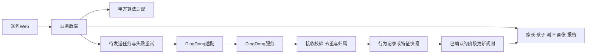

# 一期核心需求与最新代码差距

> 文档状态：2026-09-11 对参考仓库的历史差距分析，保留讨论溯源，不作为当前项目缺失功能清单。本文中双向交互、画像下发等历史范围已撤销；当前以 [已确认约束](后台设计已确认约束.md) 和 [M5验收](../backend/docs/M5_RESULT.md) 为准。

> 后续已确认修订：CA一期仅主动获取DingDong数据，不下发画像或开放供DingDong调用的接口；指纹图片仅一次性处理，不留存。本文有关双向交互及图片留存待定的历史建议已被替代，当前以[后台设计已确认约束](../需求/后台设计已确认约束.md)为准。

整理日期：2026-09-11。结论依据为原讨论中用户的直接表达、现有项目材料与最新仓库源码。本文是一期范围建议，不代表 DingDong 已确认接口或甲方已签署验收标准。

## 一期要交付什么

**交付一个有正式家长账号、能够持续保存孩子档案、调用甲方测评算法，并与机器人交换画像及成长数据的 Web 系统。** 当前优先补齐后台和数据流程，现有 V3 互动页面作为可复用的前端演示。

业务主线是：

`手机触碰 NFC → 家长登录 → 选择或建立孩子档案 → 五枚指纹采集＋问卷 → 甲方算法结果 → 初始画像与报告 → 同步给机器人 → 接收后续行为数据 → 按确认规则更新阶段画像与报告`

DingDong 接口未清楚，不意味着取消双向数据闭环，也不意味着现在就按旧接口表写死。建议把一期分成可独立验收的“Web基础闭环”和“真实机器人联调”两个里程碑；前者可以先开发，后者是完整一期目标的外部依赖。不能把Mock通过或接口预留当作真实联调完成。

## 原讨论真正确定了什么

完整原讨论已保存于[原讨论记录](../材料/讨论/梳理机器人需求_20260911.md)，共95轮，保留语音转写。下列R编号对应原记录小节。

| 结论 | 依据与确定程度 |
| --- | --- |
| 只有家长账号，孩子是账号下的档案，不单独登录 | 用户R086直接纠正；R029明确手机号＋验证码，优先级高 |
| 需要五枚指纹信息，再结合约二十多道题形成多维画像 | 用户R006—R011；“五枚”是业务描述，具体哪些手指、什么输入格式和题量仍待甲方确认 |
| 算法由甲方已有体系提供，我们负责接入 | 用户R014、R062；尚未拿到可运行接口，不能据此断言算法已具备线上接入条件 |
| 初始评分要发给机器人，机器人再给系统行为数据，画像继续变化 | 用户R018—R020直接描述；收发双方的字段、频率、规则归属未明确 |
| 后台先设计清楚，稳定性很重要 | 用户R024、R054；不是仅做静态H5 |
| 我们负责整个项目的中间一部分 | 用户R034、R043；不自动承包硬件、固件、机器人整套账号或其内部数据平台 |
| 项目经验与可复用交付能力有价值 | 用户R035、R037、R042；沉淀接口适配、运行记录与交付文档即可，不必因此扩大为通用中台 |

**不能误记为已确认需求的内容：** 独立孩子账号已被否定；多孩子数量、姓名/生日/年级是否全部必填，主要来自助手举例；自动图像质量检测被用户质疑，未确认由我们研发；Agent编排是用户询问，后续多Agent设想是助手扩展；永久保存原始指纹、向机器人发送指纹原图或特征，并非用户明确要求。也不能把讨论里的遗传、DNA等转写当作算法效果证据。

与旧材料的关系：此前PRD默认不采指纹，本次原讨论明确提出五枚指纹流程，应将它列入本轮业务范围重新对齐；现有代码的“指纹观察小游戏”不等于完成该流程。旧材料中的15/30天、五种成长数值、绑定URL，继续作为候选，不作为本轮已定协议。

## 六项一期核心需求

| 编号 | 需求与边界 | 一期验收结果 | 外部依赖 |
| --- | --- | --- | --- |
| P0-01 | 家长手机号验证码登录；建立/选择孩子档案；数据按孩子归属；保留NFC进入来源 | 同一家长重新登录能找回档案；两个家庭互相不可读；切换孩子不会串答案或报告 | 短信服务；档案字段及一期孩子数量 |
| P0-02 | 五枚指纹采集流程＋正式问卷；按会话保存进度，允许补拍和失败重试 | 记录每份输入所属孩子、会话和手指槽位；必需输入完整后才能提交；刷新能恢复已保存的业务进度 | 甲方采集规范、H5照片是否可用、题库、授权及原图留存方案 |
| P0-03 | 调用甲方算法，取得多维结果，生成可追溯的初始画像与家长报告 | 同一提交不会重复生成基线；失败有状态；结果保留输入/题库/算法版本、时间和来源；报告维度与算法含义一致 | 算法的真实输入输出、题库评分职责、报告解释模板与标准样例 |
| P0-04 | 设备关联后，把允许共享的画像/评分发送给DingDong | 关联有权属依据；发送结果可查询；失败可重试；至少获得双方约定层级的真实接收回执 | 身份映射、设备验证、接收画像接口、回执语义 |
| P0-05 | 接收DingDong提供的行为事件或聚合特征，形成阶段记录和更新画像/报告 | 能查到真实设备数据所属孩子及观察期；重复数据不重复计数；缺失不填零；一次阶段更新可追溯且不覆盖初始基线 | 真实数据样例、粒度/频率、更新规则或算法、窗口与版本 |
| P0-06 | 最小运营后台：查档案、查测评状态、查同步问题、查报告版本、重试失败任务 | 授权人员能定位一个家庭的失败步骤和原因；重试不重复提交；数据与操作有记录；备份可恢复 | 运营及专业审核负责人、维护交接方式 |

基础授权、对象权限、日志、失败处理、必要的数据删除/留存处理属于上述主流程的一部分。首期不需要把它们扩展成庞大后台。

首期建议前台先开放一个孩子档案，但后端用独立child_id关联，保留扩展余地；这是压缩范围的实现建议，**不是原讨论已确认的一户一孩限制**。姓名可先用昵称；是否需要精确生日和年级由算法输入和业务确认，不能把助手列举的字段全部设为必填。

指纹部分一期做采集引导、预览、重拍、提交及失败提示，不自行研发DMIT或图像识别算法，也不假设甲方能返回清晰度分数。具体手指槽位、格式、尺寸、张数、是否需要专用设备，需用甲方真实可接受样例验证。原图是否持久保存须先明确：若不留原图，重新打开页面可能需要重拍，不能承诺自动恢复临时图片。

机器人对画像的“云端接收”和“设备已应用”应分别记录。若一期只约定云端收取画像，验收只能证明收到，不能声称已实现个性化陪伴。四类机器人行为差异、远程任务、主动提醒和取消指令须另有明确能力承诺才纳入真机验收。

阶段更新先保留测评结果、行为统计和派生画像三层。用户希望看到动态变化，但机器人行为不能未经规则直接累加到专业测评分数。更新算法如果不由甲方提供，应作为新的实质工作包评估；只拿到聚合字段也不能承诺能做逐事件的深度挖掘。

## 最新代码实际完成了哪些部分

2026-09-11已执行git fetch，HEAD与origin/main均为`d754a5bf9ea8e71ca64a850d2e26aa321fe8ab38`，提交时间2026-09-09 22:52:30 +0800，标题为“feat: publish DingDong talent exploration demo v3”。仓库工作区干净，本轮不修改业务代码。

| 业务部分 | 已有实现与代码依据 | 相对一期仍缺少的能力 |
| --- | --- | --- |
| 页面与探索 | 8个视图；4个兴趣岛、8个本地任务、四种引导文案；[app.js](../参考代码/dingdong/app.js:39)、[playworld.js](../参考代码/dingdong/playworld.js:3) | 可保留样式和交互，不应把页面数当成业务完成度 |
| 账号与档案 | 单个state存localStorage，只有昵称/年龄演示档案；[app.js](../参考代码/dingdong/app.js:51) | 无手机号认证、服务端会话、家长实体、child_id、数据库或家庭隔离 |
| 问卷与画像 | 4道偏好情境；结果统计选项次数；[app.js](../参考代码/dingdong/app.js:100) | 无正式题库、甲方算法调用、二十多题采集、评分版本、初始画像持久化 |
| 指纹 | 单图本地预览、拍照和手选纹路；扫描仅动画；[fingerprint.js](../参考代码/dingdong/fingerprint.js:121) | 无五枚采集会话、上传/提交、算法结果、按孩子关联；该模块也不保存图片 |
| 任务与历史 | 本地任务实例ID、步骤进度、完成/跳过、自报来源；[app.js](../参考代码/dingdong/app.js:93) | 无服务端幂等、多设备一致性、可靠数据校验或机器人事件 |
| 报告 | 近15/30天本地完成次数和静态模板，明确写非正式报告；[app.js](../参考代码/dingdong/app.js:80) | 无Baseline快照、真实行为快照、版本化报告、阶段算法及可比较曲线 |
| DingDong接口 | [api.js](../参考代码/dingdong/api.js:4)定义5个候选URL；mode固定demo，getGrowth返回unbound，bind/sendTask直接报未接入 | 不是已接通适配层；没有真实网络调用。页面也未调用DingDongAPI，不能仅改mode就上线 |
| 后台与部署 | [server.cjs](../参考代码/dingdong/server.cjs:7)只是本地静态预览，/api/返回503 | 无正式API服务、数据库、队列、运营后台、认证和可靠交付运行链路 |

**V3与旧网页的重要区别：** 此次检查的fingerprint.js明确手动观察，动画后不随机分配天赋类型；旧项目分析里的随机识别问题不适用于本版本。反过来，这个纠正不意味着“五枚指纹＋甲方算法”的原需求已经实现。

目前最值得复用的是移动端界面、任务交互、演示/真实状态的区分，以及来源、实例ID、空值等设计思路。需要新增的主体是正式后台和业务数据模型。任务/报告/状态当前集中在app.js，正式化时可先把存储、会话、内容配置、接口适配拆开，不必为了使用某个框架重做所有前端。

本轮验证：6个JS/CJS文件语法检查通过；在Node隔离上下文执行api.js，验证其保持演示模式、空数据为null、bind/sendTask拒绝调用，且0值保留、非法数值转null。现有qa脚本已阅读，但本轮未运行浏览器回归、摄像头测试或真机联调；本报告不声称完整用户流程测试通过。

## DingDong字段不明确时，先确定边界和业务含义

先把“要交换什么”与“对方字段叫什么”分开。项目侧可先建立自己的内部实体和状态；旧Excel及api.js中的URL/字段仅放在候选映射中，真实连接器等对方契约确认后实现。

图中模块是业务职责，不要求一期拆成多个微服务。建议一个模块化后端、关系数据库及可持久重试的后台任务即可；如工作量很小，任务表＋后台进程也可，不预设Kafka或专门Agent平台。

| 先定义的内部对象（建议） | 核心职责 | 刻意不替对方决定的部分 |
| --- | --- | --- |
| Parent、Child | 登录身份、档案、数据归属 | DingDong是否有统一用户ID/SSO |
| AssessmentSession、InputItem | 问卷/手指槽位、输入状态、版本与提交号 | 算法输入是图片、纹路码还是其他特征；哪些手指 |
| ProfileSnapshot、Report | 结果、解释、规则版本、证据引用；历史不可静默覆盖 | 对方返回几维、单位、范围和专业含义 |
| DeviceAssociation | 一段有效绑定关系与验证状态 | source_token/nfc_token/device_alias_id是否真实存在 |
| IntegrationJob | 本方业务请求ID、关联对象、待发送/接收/失败/待确认状态 | URL、签名、轮询/回调、设备回执码 |
| Observation或FeatureSnapshot | 来源、数据粒度、观察期、上游ID/版本、接收时间 | 事件流还是聚合特征，是否能获得单次行为明细 |

可先做MockConnector和真实Connector的边界与契约测试用例；Mock使用虚构身份，记录环境标签，禁止混入正式成长档案。内部request_id只能保证本方重试一致，不能推定供应商天然幂等；超时后如无对方查单/幂等支持，应记录“结果未知待核对”，不能无限重发。

## 对接会议只需要先拿到的六组答案

| 要问清的事 | 希望拿到的最小材料 | 没拿到前可以做什么 |
| --- | --- | --- |
| NFC、家长、孩子、机器人怎样对应；谁证明设备归属？ | 一组真实样机入口、绑定操作及成功返回样例，解绑/转让规则 | 自有登录与档案、来源解析；不开放伪绑定 |
| 系统把什么画像给机器人，它收到后做什么？ | 一次成功请求/响应；字段含义；收到/应用的状态区别 | 画像存储、待发送任务与空状态页面 |
| 机器人能返回什么，按设备还是孩子、事件还是汇总、多久一次？ | 一组实际可输出样例，字段含义/单位/时间/来源 | 接收接口骨架和模拟数据；不预设秒级实时或同时建设两条数据管线 |
| 怎样处理重试、重复、离线、补数和授权撤回？ | 鉴权方式、唯一ID、查询/回执机制、重试规则、停收方式 | 本方去重、权限、队列和错误状态；不承诺跨系统已完成 |
| 甲方算法接什么、返回什么，谁负责后续画像更新？ | 可运行演示或测试服务；合格输入样例、失败样例、结果样例、版本与报告解释 | 会话与采集UI、结果容器；不制造专业分数，不自行承接算法研发 |
| 谁提供样机/测试账号、谁修接口、什么算交付？ | 指定技术对接人、测试条件、验收用例与接口可用时间 | Web独立验收，真机联调单列依赖和计划 |

算法服务与DingDong服务可能属于不同团队，应由甲方明确责任人，不能默认由DingDong负责全部算法，也不默认画像更新由我们自研。

## 先做、依赖后做、一期延后

**现在即可推进：** 确认页面主流程；设计家长—孩子—会话—画像—报告的数据关系；手机号登录和服务端权限；问卷/采集流程框架；历史与报告版本；最小后台和任务状态；把当前前端接到自有后端。具体输入校验和正式内容发布仍依赖甲方规则。

**一期目标内、外部就绪后接入：** 正式甲方算法；经过权属验证的机器人关联；画像下发；真实行为/特征接收；按批准规则完成一次阶段更新。不能简单把这些永久挪到二期，否则一期失去原讨论的核心价值。

**一期建议延后或不新增：** 自研指纹算法与图像质量评分、多Agent自动分析/自由生成专业报告、机器人固件/动作/语音底座、深度SSO、多监护人和复杂设备共享、商城支付、营销后台、复杂积分养成、大量新增兴趣岛与盲盒。现有轻量互动可保留，不作为正式业务交付的主要工作量。

## 三个验收里程碑

| 里程碑 | 交付证据 | 完成意味着什么 |
| --- | --- | --- |
| M1 正式Web基础 | 两个家长账号的隔离测试、建档和刷新恢复、采集/答题会话、失败状态、数据库及后台可查 | 自有系统具备持续记录能力；若算法仍用Mock，只验收流程，不验收正式画像 |
| M2 正式测评闭环 | 甲方可接受的输入、真实算法调用、预期结果核对、初始画像/报告版本、重复提交和失败恢复记录 | 一个孩子能完成正式的输入—算法—报告业务流程 |
| M3 真实机器人闭环 | 样机绑定、真实画像发送回执、真实回传数据、按规则产生阶段修订、断网/重试/撤回验证 | 一期跨系统闭环完成；设备已应用只在有对应证据时声明 |

排期应分别记录自有开发工作量和外部接口等待时间。当前不宜重新承诺21天完整交付。是否需要真实15/30天观察验收，要和开发期区分：模拟时间能验证窗口逻辑，不能代替家庭使用结果。

建议以这六项P0为下一轮需求冻结与报价依据，旧PRD的完整功能和V3演示的全部玩法均不自动扩大一期范围。
